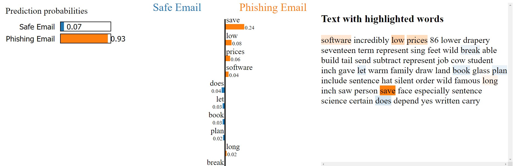
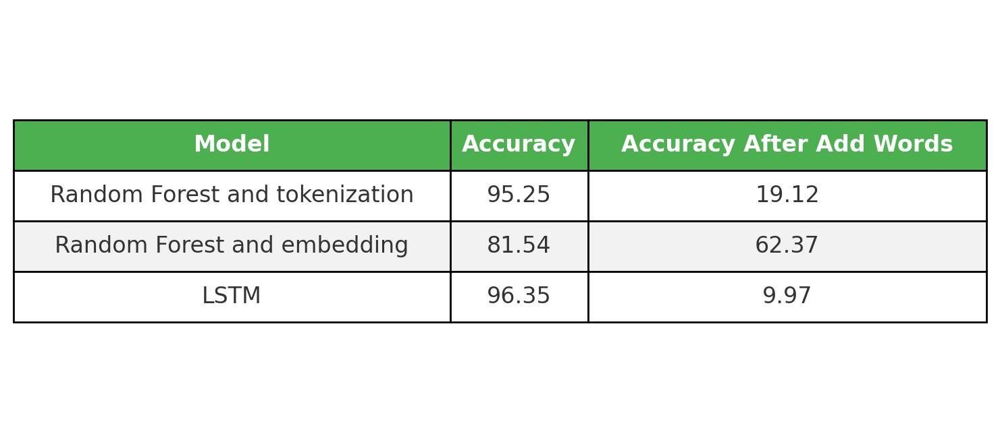
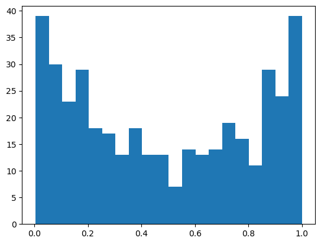

# Phishing Email Detection: Explainability and Model Sensitivity with LIME

## Introduction to LIME (Local Interpretable Model-Agnostic Explanations)

LIME, or **Local Interpretable Model-Agnostic Explanations**, is an XAI (Explainable AI) technique designed to make machine learning models more interpretable. It works by generating locally faithful explanations for individual predictions of any black-box model. This means that LIME tries to understand the model’s decision for one specific instance, such as why an email is classified as phishing.

LIME is model-agnostic, meaning it can be applied to any machine learning model, whether it's a simple logistic regression or a complex neural network. In this project, we tried by perturbing the input data (i.e., making small changes to the email text) and explanation provided by LIME to analyze the impact on the prediction and test reliablity of the model.

In this project, we use LIME to explain the predictions of three models:
- Random Forest and tokenization
- Random Forest and embedding
- LSTM

---

## Phishing Email Detection: Explainability and Model Sensitivity

This project aims to detect phishing emails using different models: Random Forest with tokenization, Random Forest with embedding, and LSTM. We used the [Phishing Emails Dataset](https://www.kaggle.com/datasets/subhajournal/phishingemails) from Kaggle for this project. We also investigate how Explainable AI (XAI) techniques, such as LIME, can help us understand and interpret the predictions of these models. In particular, we analyze how the models react when a clearly phishing email is modified with a few positive words added at the end.


```python
from lime.lime_text import LimeTextExplainer
explainer = LimeTextExplainer(class_names=['Safe Email', 'Phishing Email'], random_state=42)
exp = explainer.explain_instance(cleaned_emails[idx], pipeline.predict_proba, num_features=10)
exp.show_in_notebook(text=True)
```



## Comparison and XAI Insights

### Model Sensitivity

We also performed sensitivity analysis to see how the models react when a clearly phishing email is modified with positive words. The model's prediction before and after these changes was as follows:



This analysis demonstrated that while the LSTM model achieves higher accuracy, it is very sensitive to small changes in the data, whereas the Random Forest model and the embedding show greater stability in response to such changes. However, the key insight here is not about the models themselves, but rather how explainable AI (XAI) can help us better understand these models and address their weaknesses.
### XAI Insights
This histogram reveals that words at the beginning and end of the text have a stronger influence compared to those in the middle. The higher bars at both ends indicate that these sections contribute more to the model's predictions, suggesting that the initial and concluding words carry more weight in determining the overall meaning or classification of the text.




## Conclusion

Explainable AI (XAI) techniques, such as LIME, provide invaluable insights into the inner workings of black-box models like LSTM and Random Forest. By leveraging these techniques, we can understand which features drive the model's decisions and identify weaknesses in the model. The ability to explain model predictions also aids in improving the robustness and accuracy of the system.

## References

1. Ribeiro, M. T., Singh, S., & Guestrin, C. (2016). “Why should I trust you?”: explaining the predictions of any classifier. arXiv (Cornell University). https://doi.org/10.48550/arxiv.1602.04938
2. Deepfindr. (n.d.). xai-series/02_lime.py at master · deepfindr/xai-series. GitHub. https://github.com/deepfindr/xai-series/blob/master/02_lime.py
3. PacktPublishing. (n.d.). Hands-On-Explainable-AI-XAI-with-Python/Chapter08/LIME.ipynb at master · PacktPublishing/Hands-On-Explainable-AI-XAI-with-Python. GitHub. https://github.com/PacktPublishing/Hands-On-Explainable-AI-XAI-with-Python/blob/master/Chapter08/LIME.ipynb
4. LIME official tutorials: https://marcotcr.github.io/lime/tutorials/Tutorial%20-%20continuous%20and%20categorical%20features.html


